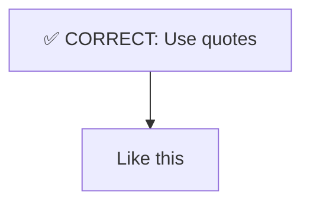

# STEM Modeling - CCB Eight-Model Distributed Protocol V7.0

## Overview

This skill implements the **STEM_SOP V7.0 八模驱动分布式协议** for creating comprehensive academic STEM documentation using CCB's eight-model architecture. It orchestrates Claude, Gemini, Codex, OpenCode, iFlow, Kimi, Qwen, and DeepSeek in a full-duplex collaborative workflow to produce publication-quality research notes.

**Version 7.0 - Eight AI Architecture:**
- ✅ Expanded from 7 to 8 AI models
- ✅ Added DeepSeek for policy research and deep reasoning
- ✅ Role assignments based on actual AI capabilities and models
- ✅ Parallel execution optimization for 8 AIs

## When to Use This Skill

Trigger this skill when the user requests:
- Academic STEM research notes or documentation
- Mathematical modeling with rigorous derivations
- Engineering documentation with code and diagrams
- Scientific papers requiring multi-layered analysis
- Cross-disciplinary synthesis combining theory, engineering, and context

## Command Reference

| AI | Current Model | Available Models | ASK Command | PING | PEND |
|---|---|---|---|---|---|
| Codex | GPT-5 | GPT-5, o3, o4-mini | `cask <<'EOF' ... EOF` | `cping` | `cpend` |
| Gemini | gemini-3-flash-preview | gemini-3-pro-preview, gemini-3-flash-preview, gemini-2.5-pro, gemini-2.5-flash | `gask <<'EOF' ... EOF` | `gping` | `gpend` |
| OpenCode | MiniMax-M2.1 | MiniMax-M2.1, DeepSeek-V3 | `oask <<'EOF' ... EOF` | `oping` | `opend` |
| iFlow | GLM-4.7 | GLM-4.7, GPT-4, Claude-3.5, Gemini-Pro | `iask <<'EOF' ... EOF` | `iping` | `ipend` |
| Kimi | Kimi (默认) | Kimi, Claude, Codex, Gemini | `kask <<'EOF' ... EOF` | `kping` | `kpend` |
| Qwen | Qwen Code | Qwen Code, Qwen2.5-Max | `qask <<'EOF' ... EOF` | `qping` | `qpend` |
| DeepSeek | DeepSeek-V3 | DeepSeek-V3, DeepSeek-R1 | `dskask <<'EOF' ... EOF` | `dskping` | `dskpend` |

**Note:** Use `/model` command in each CLI to switch models.

---

## Eight-Model Architecture (The Eight Sages)

### 🟢 Claude (Logic Architect & Orchestrator)

**Model:** claude-opus-4-5 / claude-sonnet-4
**Role:** Central coordinator and logic architect

**Core Strengths:**
- Logical reasoning and structured thinking
- Document structure and narrative flow
- **Orchestrating all 7 AIs**
- Final integration and polish

**Primary Responsibilities:**
1. **Orchestration** (30%): Coordinate all 7 AIs, dispatch tasks, monitor completion
2. **Logical Framework** (30%): Concept definitions, problem formulation, symbol table
3. **Narrative Integration** (25%): Integrate outputs, ensure smooth transitions
4. **Final Polish** (15%): Verify consistency, generate executive summary

**What Claude Does NOT Do:**
- ❌ Web search (Gemini)
- ❌ Code implementation (Codex)
- ❌ Mathematical derivations (Qwen)
- ❌ Chinese academic writing (Kimi)
- ❌ Workflow diagrams (iFlow)
- ❌ Code audit (OpenCode)

---

### 🔵 Gemini (Research Scout & SOTA Hunter)

**Model:** gemini-2.5-pro / gemini-2.5-flash
**MCP Tools:** google_search, web_fetch
**Command:** `gask <<'EOF' ... EOF`

**Core Strengths:**
- **UNIQUE: Live web search capability**
- Real-time information retrieval
- Finding latest academic papers (2024-2026)
- SOTA benchmarks and comparisons

**Primary Responsibilities:**
1. **SOTA Research** (60% - UNIQUE): Web search for latest papers, benchmarks, trends
2. **Comparative Analysis** (25%): Compare methods, analyze trade-offs
3. **Domain Context** (15%): Historical development, key researchers

**Output Format:**
- SOTA papers with citations (DOI, year, venue)
- Benchmark tables with quantitative results
- Comparison matrices

**What Gemini Does NOT Do:**
- ❌ Code implementation (Codex)
- ❌ Mathematical derivations (Qwen)
- ❌ Chinese content (Kimi)
- ❌ Workflow diagrams (iFlow)

**Task Template:**
```bash
gask <<'EOF'
【STEM_SOP V6.0 - Gemini Research Task】
Target File: [FULL ABSOLUTE PATH]

Mission: SOTA research for [topic]

Deliverables:
1. 5+ latest papers (2024-2026) with citations
2. Benchmark comparison table
3. Key methods summary

File path: [FULL ABSOLUTE PATH]
EOF
```

---

### 🟣 Codex (Code Craftsman)

**Model:** OpenAI o3 / o4-mini (via codex-cli)
**Skills:** Code generation, debugging, optimization
**Command:** `cask <<'EOF' ... EOF`

**Core Strengths:**
- **UNIQUE: Best-in-class code generation**
- Production-quality Python code
- Algorithm implementation
- Data visualization (Matplotlib, Plotly)

**Primary Responsibilities:**
1. **Code Implementation** (70% - CORE): Production-ready Python with type hints, docstrings
2. **Visualization** (20%): Matplotlib/Seaborn plots, interactive visualizations
3. **Engineering Analysis** (10%): Complexity analysis, performance benchmarking

**Code Quality Standards:**
- ✅ Type hints for all parameters
- ✅ Docstrings with purpose, params, returns
- ✅ Error handling for edge cases
- ✅ Reproducibility (`np.random.seed(42)`)
- ✅ Usage examples

**What Codex Does NOT Do:**
- ❌ Web search (Gemini)
- ❌ Mathematical proofs (Qwen)
- ❌ Chinese content (Kimi)
- ❌ Workflow diagrams (iFlow)
- ❌ Code audit (OpenCode)

**Task Template:**
```bash
cask <<'EOF'
【STEM_SOP V6.0 - Codex Code Task】
Target File: [FULL ABSOLUTE PATH]

Mission: Implement code for [topic]

Deliverables:
1. 3+ production-ready code modules
2. Usage examples with sample data
3. Performance analysis

File path: [FULL ABSOLUTE PATH]
EOF
```

---

### 🟠 OpenCode (Chinese Academic Writer & Literature Expert)

**Model:** DeepSeek-V3 (via opencode-cli)
**Skills:** Chinese NLP, long-context, academic writing, literature synthesis
**Command:** `oask <<'EOF' ... EOF`

**Core Strengths:**
- **UNIQUE: Best Chinese academic writing**
- Long-context document processing
- Literature review and synthesis
- Chinese-English bilingual content

**Primary Responsibilities:**
1. **Chinese Academic Content** (50% - CORE):
   - Case studies in Chinese (案例研究)
   - Chinese summaries (中文摘要)
   - Key findings in Chinese (关键发现)

2. **Literature Review** (30%): Synthesize sources, identify gaps, compare methodologies

3. **Bilingual Content** (20%): English-Chinese term pairs, bilingual glossary

**Chinese Case Study Template:**
```markdown
### 案例研究：[标题]

**研究背景 (Background)**
[中文描述]

**数据与方法 (Data & Methods)**
- 数据规模：[具体数字]
- 分析方法：[具体方法]

**关键发现 (Key Findings)**
1. [发现1 + 数据支持]

**启示 (Lessons Learned)**
- [启示1]
```

**What OpenCode Does NOT Do:**
- ❌ Code implementation (Codex)
- ❌ Web search (Gemini)
- ❌ Mathematical derivations (Qwen)
- ❌ Workflow diagrams (iFlow)

**Task Template:**
```bash
oask <<'EOF'
【STEM_SOP V6.0 - OpenCode Chinese Content Task】
Target File: [FULL ABSOLUTE PATH]

Mission: Create Chinese academic content for [topic]

Deliverables:
1. 3+ Chinese case studies (案例研究)
2. Chinese executive summary (中文摘要)
3. Bilingual glossary (双语术语表)

File path: [FULL ABSOLUTE PATH]
EOF
```

---

### 🔷 iFlow (Workflow Architect & Diagram Master)

**Model:** Cursor (Claude-based)
**Skills:** System design, Mermaid diagrams, architecture
**Command:** `iask <<'EOF' ... EOF`

**Core Strengths:**
- **UNIQUE: Best Mermaid diagram generation**
- System architecture design
- Workflow and process diagrams
- State machine design

**Primary Responsibilities:**
1. **Mermaid Diagrams** (50% - CORE): Flowcharts, sequence, state, class diagrams
2. **System Architecture** (30%): High-level design, component relationships
3. **Process Documentation** (20%): Step-by-step workflows, decision trees

**Mermaid Syntax Rules (CRITICAL):**


**What iFlow Does NOT Do:**
- ❌ Code implementation (Codex)
- ❌ Web search (Gemini)
- ❌ Mathematical proofs (Qwen)
- ❌ Chinese content (Kimi)

**Task Template:**
```bash
iask <<'EOF'
【STEM_SOP V6.0 - iFlow Diagram Task】
Target File: [FULL ABSOLUTE PATH]

Mission: Create diagrams for [topic]

Deliverables:
1. 3+ Mermaid diagrams (flowchart, sequence, state)
2. System architecture diagram
3. Process workflow

CRITICAL: Use A["text"] format for all nodes!

File path: [FULL ABSOLUTE PATH]
EOF
```

---

### 🔴 Kimi (Code Auditor & Syntax Guardian)

**Model:** Moonshot-v1 (Kimi)
**Skills:** Code review, syntax validation, quality assurance, long-context (200K+)
**Command:** `kask <<'EOF' ... EOF`

**Core Strengths:**
- **UNIQUE: Thorough code audit with long-context**
- Code review and bug detection
- Syntax validation (Mermaid, LaTeX, Markdown)
- Security analysis

**Primary Responsibilities:**
1. **Code Audit** (50% - CORE): Review code for bugs, security, completeness
2. **Syntax Validation** (30%): Mermaid `A["text"]`, LaTeX `$$`, tables, code blocks
3. **Technical Quality Report** (20%): Quantitative audit report

**Audit Report Format:**
```markdown
## Technical Audit Report
| Metric | Count | Target | Status |
|--------|-------|--------|--------|
| Code modules | X | ≥5 | ✅/❌ |
| Syntax errors | X | 0 | ✅/❌ |
```

**What Kimi Does NOT Do:**
- ❌ Write new code (Codex)
- ❌ Web search (Gemini)
- ❌ Mathematical proofs (Qwen)
- ❌ Chinese content (OpenCode)

**Task Template:**
```bash
kask <<'EOF'
【STEM_SOP V6.0 - Kimi Audit Task】
Target File: [FULL ABSOLUTE PATH]

Mission: Audit code and syntax

Deliverables:
1. Code review report
2. Syntax validation results
3. Fix recommendations

File path: [FULL ABSOLUTE PATH]
EOF
```

---

### 🟡 Qwen (Mathematical Sage)

**Model:** Qwen2.5-Max / Qwen-Coder (Alibaba)
**Skills:** Mathematical reasoning, LaTeX, code+math integration
**Command:** `qask <<'EOF' ... EOF`

**Core Strengths:**
- **UNIQUE: Best mathematical reasoning**
- Step-by-step proofs and derivations
- LaTeX formula generation
- Code + mathematics integration

**Primary Responsibilities:**
1. **Mathematical Derivations** (50% - CORE): Step-by-step proofs, formula derivations
2. **LaTeX Formulas** (30%): Key equations, aligned derivations, definitions
3. **Comparison Tables** (20%): Method comparisons with mathematical criteria

**LaTeX Format Standards:**
```latex
$$
\begin{aligned}
f(x) &= \int_0^x g(t) \, dt \\
     &= G(x) - G(0)
\end{aligned}
$$
```

**Comparison Table Template:**
```markdown
| 对比维度 | 方法A | 方法B |
|---------|------|------|
| 时间复杂度 | O(n) | O(n log n) |
| 空间复杂度 | O(1) | O(n) |
| 收敛性 | [证明] | [证明] |
```

**What Qwen Does NOT Do:**
- ❌ Code implementation (Codex)
- ❌ Web search (Gemini)
- ❌ Chinese case studies (Kimi)
- ❌ Workflow diagrams (iFlow)

**Task Template:**
```bash
qask <<'EOF'
【STEM_SOP V6.0 - Qwen Math Task】
Target File: [FULL ABSOLUTE PATH]

Mission: Mathematical derivations for [topic]

Deliverables:
1. 10+ LaTeX formulas with derivations
2. Step-by-step proofs
3. Complexity analysis
4. Comparison tables with mathematical criteria

File path: [FULL ABSOLUTE PATH]
EOF
```

---

### ⚫ DeepSeek (Deep Reasoning Sage)

**Model:** DeepSeek-V3 / DeepSeek-R1
**Skills:** Deep reasoning, logical analysis, policy research, complex problem solving
**Command:** `dskask <<'EOF' ... EOF`

**Core Strengths:**
- **UNIQUE: Best deep reasoning and logical analysis**
- Complex multi-step reasoning
- Policy and regulatory analysis
- Cross-domain synthesis

**Primary Responsibilities:**
1. **Deep Reasoning** (50% - CORE): Complex logical chains, multi-step analysis
2. **Policy Analysis** (30%): Regulatory implications, policy interpretation
3. **Synthesis** (20%): Cross-domain integration, holistic conclusions

**Reasoning Format Standards:**
```markdown
### 推理链 (Reasoning Chain)

**前提 (Premises):**
1. [前提1]
2. [前提2]

**推理步骤 (Steps):**
1. 由前提1和前提2，可得...
2. 进一步推导...
3. 因此...

**结论 (Conclusion):**
[最终结论]
```

**What DeepSeek Does NOT Do:**
- ❌ Code implementation (Codex)
- ❌ Web search (Gemini)
- ❌ Mathematical proofs (Qwen)
- ❌ Workflow diagrams (iFlow)

**Task Template:**
```bash
dskask <<'EOF'
【STEM_SOP V7.0 - DeepSeek Reasoning Task】
Target File: [FULL ABSOLUTE PATH]

Mission: Deep reasoning analysis for [topic]

Deliverables:
1. Multi-step reasoning chains
2. Policy/regulatory analysis
3. Cross-domain synthesis
4. Logical conclusions with evidence

File path: [FULL ABSOLUTE PATH]
EOF
```

---

## Execution Modes

### Mode 1: Auto-Pilot (Sequential Execution)

**Trigger:** "auto-pilot" / "自动" / "批量"

**Protocol:**
1. Claude initializes structure
2. Launch AIs **sequentially** (one completes before next starts)
3. Monitor each completion via bash-notification before proceeding
4. Integrate all outputs after all complete

**Sequential Execution Order:**
```
Gemini → Qwen → OpenCode(中文) → Codex → iFlow → Kimi(审计) → DeepSeek(深度推理) → Claude(整合)
```

**Sequential Launch Example:**
```bash
# Step 1: Launch Gemini first
gask <<'EOF'
[Gemini SOTA research task]
EOF
# Wait for completion...

# Step 2: Launch Qwen after Gemini completes
qask <<'EOF'
[Qwen math task]
EOF
# Wait for completion...

# Step 3: Launch OpenCode (Chinese content) after Qwen completes
oask <<'EOF'
[OpenCode Chinese content task]
EOF
# Wait for completion...

# Step 4: Launch Codex after OpenCode completes
cask <<'EOF'
[Codex code task]
EOF
# Wait for completion...

# Step 5: Launch iFlow after Codex completes
iask <<'EOF'
[iFlow diagram task]
EOF
# Wait for completion...

# Step 6: Launch Kimi (Audit) after iFlow completes
kask <<'EOF'
[Kimi audit task]
EOF
# Wait for completion...

# Step 7: Launch DeepSeek (Deep Reasoning) after Kimi completes
dskask <<'EOF'
[DeepSeek deep reasoning task]
EOF
# Wait for completion...

# Step 8: Claude final integration
```

### Mode 2: Interactive (Step-by-Step with Approval)

**Trigger:** "interactive" / "step-by-step"

**Protocol:**
1. Claude initializes → Ask user approval
2. Launch Gemini → Show results → Ask approval
3. Launch Qwen → Show results → Ask approval
4. Launch OpenCode (中文) → Show results → Ask approval
5. Launch Codex → Show results → Ask approval
6. Launch iFlow → Show results → Ask approval
7. Launch Kimi (审计) → Show audit → Ask approval
8. Launch DeepSeek (深度推理) → Show results → Ask approval
9. Final integration

---

## Eight-AI Collaboration Flow

```
                    Claude (Orchestrator)
                           │
           ┌───────────────┼───────────────┐
           │               │               │
           ▼               ▼               ▼
    ┌──────────┐    ┌──────────┐    ┌──────────┐    ┌──────────┐
    │  Gemini  │    │   Qwen   │    │   Kimi   │    │ DeepSeek │
    │ (SOTA)   │    │  (Math)  │    │(Chinese) │    │(Reasoning)│
    └────┬─────┘    └────┬─────┘    └────┬─────┘    └────┬─────┘
         │               │               │               │
         └───────────────┼───────────────┴───────────────┘
                         │
           ┌─────────────┼─────────────┐
           │             │             │
           ▼             ▼             ▼
    ┌──────────┐  ┌──────────┐  ┌──────────┐
    │  Codex   │  │  iFlow   │  │ OpenCode │
    │  (Code)  │  │(Diagrams)│  │ (Audit)  │
    └────┬─────┘  └────┬─────┘  └────┬─────┘
         │             │             │
         └─────────────┼─────────────┘
                       │
                       ▼
                    Claude
              (Final Integration)
```

### Collaboration Matrix

| From | To | When | What to Pass |
|------|-----|------|--------------|
| Claude | All 7 | Start | Research questions, file path |
| Gemini | Qwen | Done | SOTA papers, benchmarks |
| Qwen | OpenCode | Done | Formulas, proofs |
| OpenCode | Codex | Done | Chinese content |
| Codex | iFlow | Done | Code for diagrams |
| iFlow | Kimi | Done | Diagrams for validation |
| Kimi | DeepSeek | Done | Audit report |
| DeepSeek | Claude | Done | Deep reasoning analysis |

---

## Quality Checklist

### Content Requirements
- [ ] 10+ LaTeX formulas (Qwen)
- [ ] 5+ code examples (Codex)
- [ ] 3+ Mermaid diagrams (iFlow)
- [ ] 3+ Chinese case studies (Kimi)
- [ ] 5+ SOTA references (Gemini)
- [ ] Syntax validated (OpenCode)
- [ ] Deep reasoning analysis (DeepSeek)

### Formatting
- [ ] Mermaid uses `A["text"]` format
- [ ] LaTeX in separate `$$` blocks
- [ ] Tables properly aligned
- [ ] Code blocks have language tags

---

## Troubleshooting

### AI Not Responding
1. Check connectivity: `[x]ping` (e.g., `gping`, `cping`, `dskping`)
2. Check previous output: `[x]pend` (e.g., `gpend`, `cpend`, `dskpend`)
3. Relaunch with simplified task

### File Path Issues
- **ALWAYS** use full absolute paths
- Verify file exists before launching
- Include path at BOTH start and end of task

---

## Version History

**V7.0 (2026-01-27) - Eight AI Architecture:**
- ✅ Expanded from 7 to 8 AI models
- ✅ Added DeepSeek for deep reasoning and policy analysis
- ✅ Updated collaboration matrix for 8 AIs
- ✅ Enhanced sequential execution order

**V6.0 (2026-01-26) - Seven AI Architecture:**
- ✅ Expanded from 4 to 7 AI models
- ✅ Added iFlow (Cursor) for Mermaid diagrams
- ✅ Added Kimi (Moonshot) for Chinese academic writing
- ✅ Added Qwen (Alibaba) for mathematical derivations
- ✅ Reassigned roles based on actual AI capabilities
- ✅ Updated collaboration matrix for 7 AIs
- ✅ Parallel execution optimization

**V5.1 (2026-01-25):** Four-model architecture with role optimization

---

## Summary: Eight-AI Division

| AI | Current Model | Core Specialty | Unique Capability |
|---|---|---|---|
| 🟢 Claude | claude-opus-4-5 | Orchestration, Logic | Central coordinator |
| 🔵 Gemini | gemini-3-flash-preview | SOTA Research | Live web search |
| 🟣 Codex | GPT-5 | Code Implementation | Best code generation |
| 🟠 OpenCode | DeepSeek-V3 | Chinese Content | Best Chinese writing |
| 🔷 iFlow | GLM-4.7 | Diagrams | Best Mermaid |
| 🔴 Kimi | Kimi (默认) | Code Audit | Thorough review |
| 🟡 Qwen | Qwen Code | Mathematics | Best math reasoning |
| ⚫ DeepSeek | DeepSeek-V3 | Deep Reasoning | Best logical analysis |

---

*STEM_SOP Version: V7.0-CCB*
*Last Updated: 2026-01-27*
*Architecture: Eight-Model Distributed Protocol*